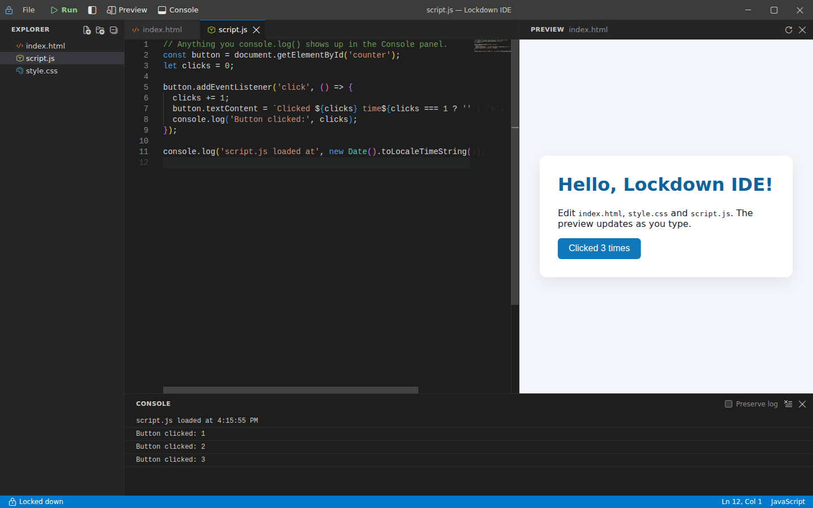

# Lockdown IDE

A locked-down desktop code editor for training and assessment. It aims to make
copying code out (to paste into an AI chat) and pasting generated code in more
trouble than just writing it yourself, while still being pleasant to use every day.



**Phase 1** (this folder): Electron + Vite + vanilla TypeScript + Monaco.

- Monaco editor with tabs, a file explorer and an **in-memory virtual file system**
- IntelliSense for HTML, CSS, JavaScript/TypeScript and JSON (Monaco language services), plus keyword/snippet completion for Python and Markdown
- **Internal-only clipboard**: copy/cut/paste work everywhere in the IDE, but nothing reaches the OS clipboard and nothing from it gets in
- **Sandboxed live preview** of the workspace (reloads 500 ms after you stop typing) with a **console panel** that shows the preview's `console.*` output and errors
- VS Code Dark+ look, frameless window with a custom title bar, resizable and toggleable panes

## Getting started

Requires Node.js 22.12 or newer.

```bash
npm install
npm run dev        # Vite dev server + Electron, with hot reload
```

Electron 44 downloads its binary the first time it runs, so the first
`npm run dev` takes a little longer.

| Script | What it does |
| --- | --- |
| `npm run dev` | Start the app in development mode |
| `npm run build` | Typecheck, then build the renderer (`dist/`) and main/preload (`dist-electron/`) |
| `npm start` | Run the production build (after `npm run build`) |
| `npm test` | Unit tests (Vitest) |
| `npm run test:e2e` | Build, then drive the real Electron app with Playwright |
| `npm run typecheck` | TypeScript only |

On **Linux**, `npm run dev` launches Electron with `--no-sandbox`, because a
fresh `node_modules` has no SUID sandbox helper. The per-window renderer
sandbox (no Node.js in the page) still applies.

### Try the protections

1. Copy some code in the editor, then paste it back in: it works.
2. Paste in Notepad (or any other app): nothing is there.
3. Copy text in another app and press Ctrl+V in the editor: the status bar says it was blocked.
4. Select text in the preview and press Ctrl+C: blocked.
5. Press F12 or Ctrl+Shift+I: nothing opens.
6. Take a screenshot (Windows/macOS): the window is blacked out or missing.

## Keyboard shortcuts

App shortcuts are handled by the main process, so they also work while the preview has focus.

| Shortcut | Action |
| --- | --- |
| Ctrl+S / Ctrl+Shift+S | Save / Save all (files are kept in memory) |
| F5 | Run: reload the preview |
| Ctrl+N | New file |
| Ctrl+W | Close tab (asks about unsaved changes) |
| Ctrl+Tab / Ctrl+Shift+Tab | Next / previous tab |
| Ctrl+B | Toggle sidebar |
| Ctrl+Shift+V | Toggle preview |
| Ctrl+\` | Toggle console |
| F2 / Delete | Rename / delete the selected explorer item |

On macOS use Cmd instead of Ctrl (except Ctrl+Tab and Ctrl+\`).

## Security model

Every protection is enforced in the main process where possible, with
renderer-side checks as a second layer. Each security block in the code is
marked with a `SECURITY:` comment.

| Threat | Mitigation | Code |
| --- | --- | --- |
| Copying code to another app | `copy`/`cut`/`paste` are intercepted at the window (capture phase) and served from an in-memory buffer. `clipboardData` never receives text, only a content-free marker type. | `src/clipboard/clipboard.ts` |
| Pasting code from another app (e.g. AI output) | The OS clipboard is never read. If it holds something not copied in the IDE, paste is refused. | `src/clipboard/clipboard.ts` |
| `navigator.clipboard` | Replaced with a stub that always rejects; the clipboard permissions are denied as well. | `src/security/lockdown.ts`, `electron/security.ts` |
| Clipboard writes the renderer can't see (nested frames, capture tools) | Main-process sentinel: if the OS clipboard changed while the IDE was focused, it is cleared on blur. On Linux the PRIMARY (middle-click) selection is cleared continuously. | `electron/clipboardGuard.ts` |
| Drag-and-drop out or in | `dragstart` and `drop` are blocked app-wide; Monaco's drop-into-editor is off. | `src/security/lockdown.ts` |
| Copy/drag inside the preview | An injected script blocks clipboard and drag events inside the preview document and removes `navigator.clipboard`. | `electron/previewShim.ts` |
| Screenshots / screen recording | `setContentProtection(true)` (Windows 10 2004+ and macOS). | `electron/main.ts` |
| DevTools | `devTools: false`; F12, Ctrl+Shift+I/J/C are swallowed in `before-input-event` before any page sees them. Packaged builds refuse to start with `--remote-debugging-port` / `--inspect`. | `electron/shortcuts.ts`, `electron/security.ts`, `electron/main.ts` |
| Browser save/print dialogs | Ctrl+S is handled internally, Ctrl+R/Ctrl+U are swallowed, `print()` is disabled. | `electron/shortcuts.ts`, `src/security/lockdown.ts` |
| Right-click menu | Blocked app-wide; Monaco's context menu is off. | `src/security/lockdown.ts` |
| Leaving the app / opening sites | Top-level and frame navigation is vetoed, `window.open` is denied, `<webview>` is refused, and all `http(s)`/`ws(s)`/`file` requests are cancelled (except the Vite server in dev). | `electron/security.ts` |
| Code in the preview reaching the network | `sandbox="allow-scripts"` only (opaque origin: no popups, top navigation, forms, modals or downloads), Permissions Policy denies clipboard/capture, and a strict CSP allows nothing but the workspace itself. | `src/preview/preview.ts`, `electron/previewContent.ts` |
| Opening the workspace in another program | Files exist only in memory: there is no path on disk. The renderer is served from a custom `lockdown://` protocol, not `file://`. | `src/editor/fileSystem.ts`, `electron/main.ts` |
| Renderer compromise / escalation | `contextIsolation`, `sandbox`, no `nodeIntegration`, a strict CSP, a minimal typed preload bridge, and IPC that only accepts the IDE's own top frame. | `electron/main.ts`, `electron/preload.ts` |

### How the preview works

The renderer publishes the current text of every file (unsaved edits
included) to the main process over IPC. The main process serves that snapshot
at `lockdown-preview://workspace/…` to a sandboxed iframe, adding a strict
CSP and injecting a small script that forwards `console.*`, errors and
blocked actions to the console panel. Because the files are served from a
real origin, relative references just work: `<link href="style.css">`,
`<script src="app.js">`, ES module imports, `fetch('data.json')` and links
between pages. The preview follows the active HTML file.

### Known limitations

This is a deterrent, not a perfect prison. In particular:

- **Phone cameras and second computers** can always capture the screen.
- **Content protection** is a no-op on Linux. On macOS, apps that use ScreenCaptureKit can still capture the window.
- **Files are in memory only.** "Save" commits your edits within the session, but closing the app discards the workspace (you are warned about unsaved changes). Persistence, for example encrypted with `safeStorage`, is a natural next step.
- **Code running in the preview** can create nested frames that the injected script does not instrument. The clipboard sentinel still catches clipboard writes from them, but a text drag out of such a frame is not blocked.
- **Packaging** is not set up yet. When it is, flip the [Electron Fuses](https://www.electronjs.org/docs/latest/tutorial/fuses) (`RunAsNode`, `EnableNodeOptionsEnvironmentVariable`, `EnableNodeCliInspectArguments` off; `OnlyLoadAppFromAsar` and ASAR integrity on), or a user can re-enable debugging through environment variables.
- **Alt+Tab and other apps** are still reachable. Kiosk mode and focus trapping are Phase 3.

## Project structure

```
lockdown-ide/
├── package.json
├── vite.config.ts            # renderer build + vite-plugin-electron (main/preload)
├── electron/
│   ├── main.ts               # window, protocols, IPC, lifecycle
│   ├── preload.ts            # the only renderer ↔ main bridge (window.lockdown)
│   ├── security.ts           # CSP, permissions, network filter, navigation guards, key policy
│   ├── shortcuts.ts          # pure keyboard policy (DevTools/app shortcuts)
│   ├── clipboardGuard.ts     # OS clipboard sentinel
│   ├── previewContent.ts     # lockdown-preview:// responses, CSP, snapshot validation
│   └── previewShim.ts        # script injected into every preview page
├── shared/ipc.ts             # IPC channels and bridge types
├── src/
│   ├── index.html
│   ├── main.ts               # renderer entry: wires everything together
│   ├── editor/
│   │   ├── monaco.ts         # Monaco setup: workers, languages, theme, editor options
│   │   ├── documents.ts      # Monaco models (working copies) + dirty tracking
│   │   ├── tabs.ts           # tab management
│   │   ├── explorer.ts       # file tree
│   │   ├── fileSystem.ts     # virtual in-memory file system
│   │   ├── languages.ts      # extension → language, Python/Markdown completions
│   │   └── starterFiles.ts
│   ├── clipboard/
│   │   ├── clipboard.ts      # internal clipboard
│   │   └── copyText.ts       # Monaco-accurate copy semantics (pure)
│   ├── preview/preview.ts    # sandboxed iframe preview
│   ├── console/console.ts    # console/output panel
│   ├── layout/               # split panes, title bar, status bar
│   ├── security/lockdown.ts  # renderer-side lockdowns
│   ├── ui/                   # dialog, file icons
│   └── styles/main.css
└── tests/
    ├── unit/                 # Vitest: VFS, copy semantics, key policy, preview server
    └── e2e/                  # Playwright + Electron: clipboard, security, editor, preview
```

## Tests

`npm run test:e2e` builds with `--mode e2e`, which adds a few read-only test
hooks (`window.__lockdownE2E`) that normal builds compile out. The clipboard
tests read the **real OS clipboard** from the main process after each step to
prove that nothing leaks out and nothing external gets in. On a headless
Linux box, run them under `xvfb-run`.

## Roadmap

- **Phase 2**: whitelisted documentation browser panel (MDN, DevDocs, official docs), with search scoped to allowed domains.
- **Phase 3**: kiosk mode (fullscreen, block Alt+Tab, trap focus) and detection of screen-capture tools.
- **Phase 4**: Python via Pyodide; Run picks the runtime from the file type.
- **Phase 5**: login, activity logging (keystroke vs. paste ratio) and file submission.
